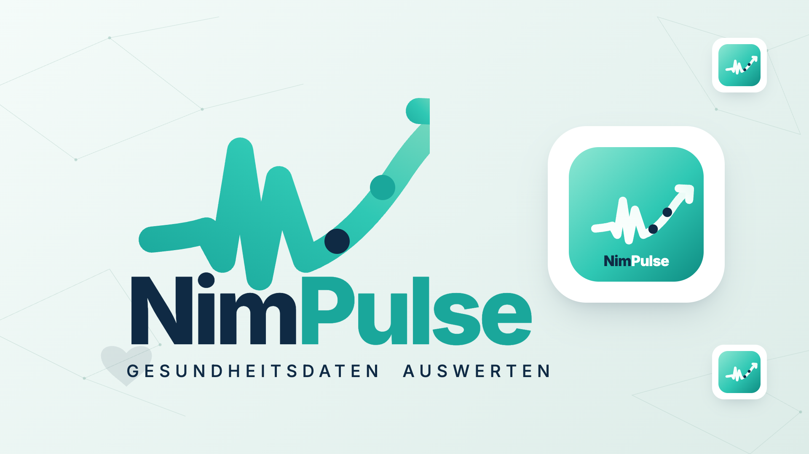

# NimPulse



Self-hosted Familien-Gesundheitsplattform: Apple-Health-Sync, Mehrbenutzer, Auswertung und ein KI-Assistent, der die eigenen Gesundheitsdaten erklärt — nicht diagnostiziert. Azure-basiert, .NET 8, iOS-App mit HealthKit.

[](https://portal.azure.com/#create/Microsoft.Template/uri/https%3A%2F%2Fraw.githubusercontent.com%2Fmnimtz%2Fnimpulse%2Fmain%2Finfra%2Fazuredeploy.json)
[](http://armviz.io/#/?load=https%3A%2F%2Fraw.githubusercontent.com%2Fmnimtz%2Fnimpulse%2Fmain%2Finfra%2Fazuredeploy.json)

> Der Deploy-Button funktioniert erst, sobald dieses Repo unter `github.com/mnimtz/nimpulse` liegt (oder die URLs entsprechend angepasst werden) und ein Container-Image unter `ghcr.io/mnimtz/nimpulse` existiert.

## Stand (v0.1.0 — Konzeptphase / Phase 0)

- [x] .NET-8-Solution mit `/api/v1`-Struktur
- [x] AI-Provider-Abstraktion: Claude (Sonnet 5, Anthropic API) + GPT-5.6 (Azure OpenAI Service), austauschbar über `Ai:DefaultProvider`
- [x] iOS-Grundgerüst (xcodegen, Team KQGPPH4S33, Bundle `email.nimtz.nimpulse`)
- [x] HealthKit: Autorisierungsanfrage für praktisch alle iOS-Gesundheitsdatentypen (siehe [docs/HEALTHKIT.md](docs/HEALTHKIT.md))
- [x] 1-Click-Azure-Deploy-Template (App Service + Azure Files/SQLite + Blob für Berichte)
- [ ] Mehrbenutzer/Familienkonten (Phase 2)
- [ ] Berichte, Wocheninsights (Phase 3)

Sprachumfang: **Deutsch + Englisch** (bewusst kein EFIGS+NL für dieses Projekt).

## Lokal entwickeln

### API

```bash
dotnet build
dotnet run --project src/NimPulse.Api
```

AI-Keys lokal setzen, statt sie in `appsettings.json` einzutragen:

```bash
export Ai__Claude__ApiKey="sk-ant-..."
export Ai__AzureOpenAi__Endpoint="https://<resource>.openai.azure.com/"
export Ai__AzureOpenAi__ApiKey="..."
export Ai__AzureOpenAi__DeploymentName="<deployment-name>"
```

Test-Endpoint: `POST /api/v1/ai/chat` mit `{"message": "...", "provider": "claude"}` (`provider` optional, Standard ist `claude`).

### iOS

```bash
cd ios
xcodegen generate
open NimPulse.xcodeproj
```

Nach jeder neuen `.swift`-Datei erneut `xcodegen generate` ausführen.

## 1-Click Deploy

Klick den **Deploy to Azure**-Button oben. Pflichtparameter: `siteName`. AI-Keys (`anthropicApiKey`, `azureOpenAiApiKey`, ...) können beim Deploy gesetzt oder später in der App-Service-Configuration nachgetragen werden.

## Projektstruktur

```
src/NimPulse.Api/     # ASP.NET Core Web-API (/api/v1)
src/NimPulse.Core/    # AI-Provider-Abstraktion, Domänenlogik
ios/                  # SwiftUI-App, xcodegen-verwaltet
infra/azuredeploy.json # 1-Click ARM-Template
docs/                 # HealthKit-Datenumfang, weitere Notizen
```
